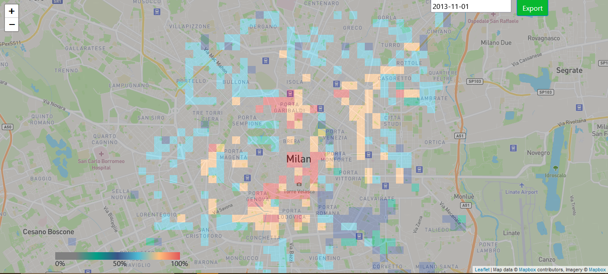
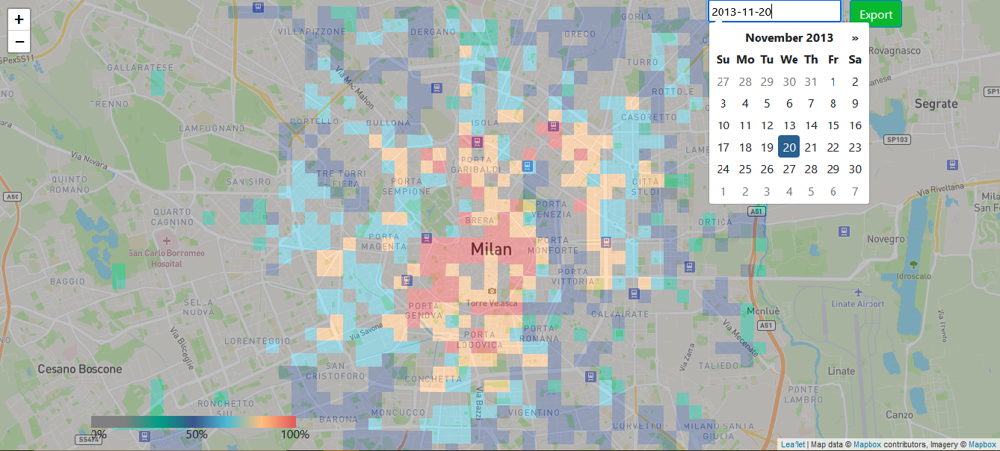
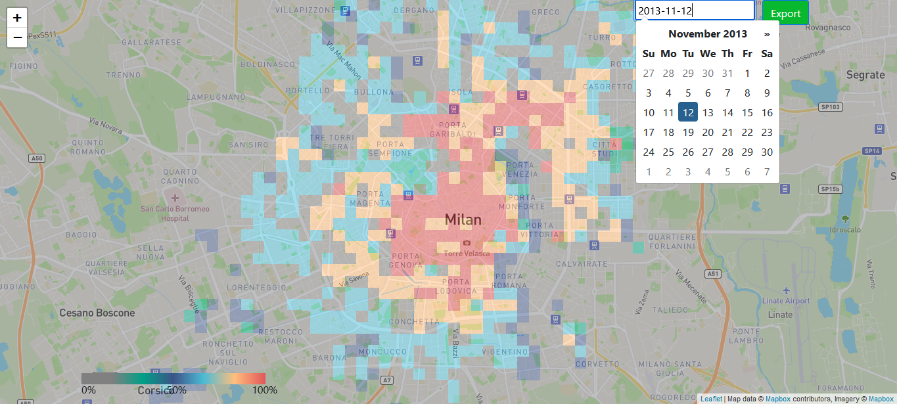
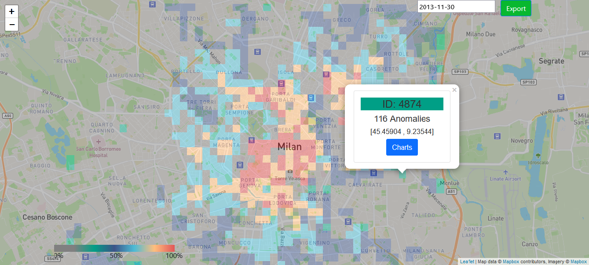
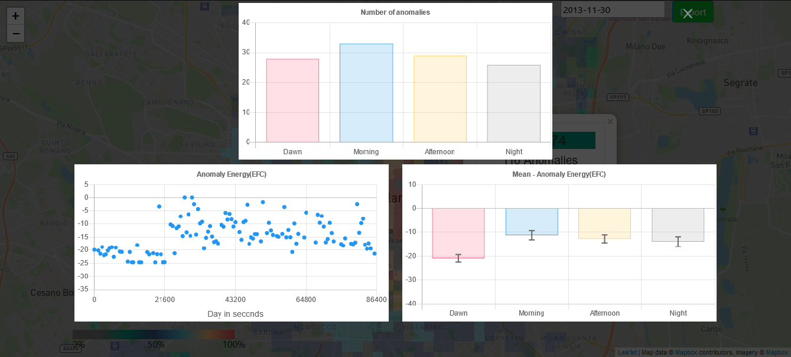

# Milan-Cluster
A web tool able to show the network volume of 5G traffic, plus the number of anomalies identified, in areas of the city of Milan, Italy. Not only that, but also, it can plot the graphics of the energy of these anomalies, the mean of the energies and a mean of the number of anomalies throughout the day.

The data has only 2 days to minimize use, however there is the entire data with the geojson generation. To generate the geojson use the python script tools_functions.py. In the file there is some functions used during the development, however only two must be used. The function to split_csv_by_day the CSV in smaller files by day. Then, use the function to merge_all_days_to_geosjon, that will insert in the geojson the data necessary to generate the areas in the map.
 
Clone the repo, and use npm install. Also, use a HTTP server on your IDE.

IMPORTANT

The images below use the mapbox sytle of mapping, to use you must have a access token. If you don't want do use MapBox, just comment the line and uncomment the OpenStreet map function below in the script.js file.

Below some images to show the tool working.

## Initial Page

## Selecting a Day
### November 20th

### November 12th

## Selecting a Area

## Ploting Graphs (Selected Area Above)
